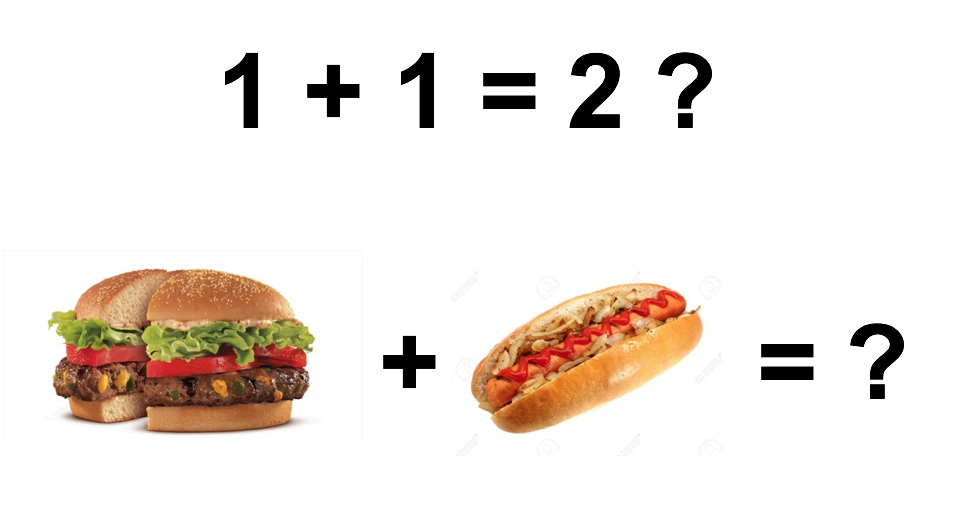
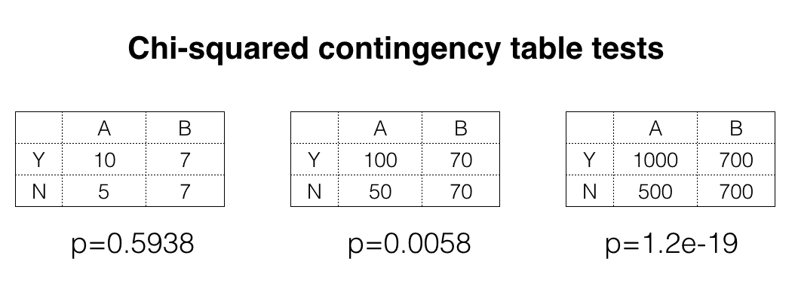
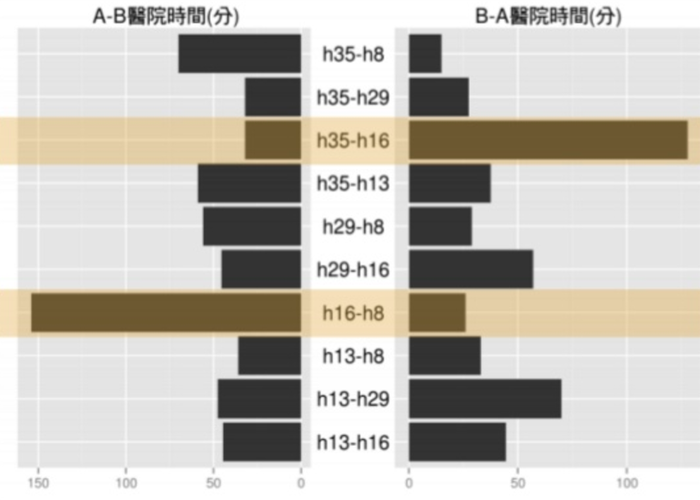

## About Me {.columns-2}
```{r setup, include=FALSE, cache=FALSE}
library(knitr)
library(magrittr)
library(xtable)
library(dplyr)
library(ggplot2)
opts_chunk$set(echo = FALSE, cache=TRUE, comment="", cache.path = ".cache-EDA/")
fig <- function(path, size = 100) {
  sprintf("</img>", 
          path, size, size)
}
fig2 <- function(path, size = 100) {
  sprintf("</img>", 
          path, size)
}
sys_name <- Sys.info()["sysname"] %>% tolower
sys_encode <- c("utf8", "utf8", "big5")[pmatch(sys_name, c("linux", "darwin", "windows"))]
sessionInfo() %>% capture.output %>% cat(file = "sessionInfo.log", sep = "\n")
```
### 谢宗震 博士 (Johnson Hsieh)
- R语言年资 10年
- 新竹清华统计 博士 (2009 - 2013)
- **DSP智库驱动** 首席资料科学家 (dsp.im)
- 行政院青年谘询委员会 委员
- 台北市公参会**开放资料组** 顾问
- D4SG资料英雄计划主持人
- Taiwan R User group officer
- R package: `iNEXT`, `CARE1`, `JADE`, `SpadeR`, `iNextPD` ...

<br>
<p>
<br>

`r fig("johnson.jpg")`
<br>
<font size="2">
Johnson 致力于资料科学顾问服务，跨足零售、制造、新闻、电信、家防等领域，现职智库驱动首席资料科学家，辅导政府机关、企业、非营利组织导入资料科学。
</font>


##

Hsieh, T. C., K. H. Ma, and Anne Chao. "`iNEXT`: an R package for rarefaction and extrapolation of species diversity (Hill numbers)." Methods in Ecology and Evolution (2016, cover artilce).

<center>
`r fig("inext_cover2.png",50)`
</center>
<font size="2">
This cover image shows a beautiful, brilliantly colored fairy pitta (Pitta nympha) perched on a bamboo branch. The migratory fairy pitta breeds in Northeast Asia (Japan, South Korea, east China and Taiwan) from late April to September and winters mainly in Borneo from October to March.
</font>


## {.vcentered .centered}

<p style="font-size: 180%">
这场演讲将讲述我们跟大型企业交手的经验，</p>
<br>
<p style="font-size: 180%">
分享如何在地雷区完成任务的心得，
</p>
<br>
<p style="font-size: 180%">
特别适合想要**组队接外包**数据专案的团队，
</p>
<br>
<p style="font-size: 180%">
还有想启动一个数据科学专案的**企业**。
</p>

## Agenda

<ul style="font-size: 140%">
<li>没看到资料前，都是假的！</li>
<li>没做 EDA 前，都是假的！</li>
<li>模型的准确度，都是假的！</li>
</ul>

# 没看到资料前，都是假的！

## 资料的极限 - columns {.vcentered .centered}
</img>

> - 一个问题是否能透过资料解决和资料搜集与记录的方式有关。

## 资料的极限 - row {.vcentered .centered}
</img>

> - 样本中的稀有事件或是未曾发生的事件难以配适模型。

## 资料的极限 - sample size {.vcentered .centered}
</img>

> - 统计显著性会受到样本数不足所影响。


## 资料的极限 - sample size
```{r echo=TRUE}
# R code here
x <- matrix(c(10, 5, 7, 7), ncol=2)
chisq.test(x)$p.value

y <- matrix(c(100, 50, 70, 70), ncol=2)
chisq.test(y)$p.value

z <- matrix(c(1000, 500, 700, 700), ncol=2)
chisq.test(z)$p.value
```
<center>
- 统计显著性会受到样本数不足所影响。
</center>

# 没做 EDA 前，都是假的！

## 资料的品质 - missing value {.vcentered .centered}
</img>

> - 即使在资讯系统中事先规划好栏位，还是有可能失败。

## 资料的品质 - error log {.vcentered .centered}
```{r message=FALSE, warning=FALSE}
set.seed(123)
x <- seq(as.Date("2010/1/1"), as.Date("2015/1/1"), "days")
y <- arima.sim(list(order = c(1,1,0), ar = 0.7), n=length(x)-1)
y <- y + abs(min(y)) + 10
y[1000:1400] <- NA
dat <- data.frame(x, y)
ggplot(data=dat, aes(x=x,y=y)) +
  geom_point(size=0.5, col=adjustcolor(1,1)) +
  labs(x="Date", y="Value") +
  scale_x_date(date_breaks = "4 month") +
  geom_point(data=subset(dat, is.na(y)), 
             aes(x, y=0), col=2, size=0.5) +
  theme(axis.text.x = element_text(angle = 90, hjust = 1), 
        text=element_text(size=18))
```

> - 当感测器报错时，不一定能够用遗漏值插补来处理。


## 资料的品质 - illogic  {.vcentered .centered}
### A/B医院相互转诊时间差异过大
</img>

> - 合乎资料系统逻辑，但是与真实经验不合。

## 资料的品质 - unclear  {.vcentered .centered}
</img>

> - 预先规划的BI介面，不一定能够正式实行。

## 资料的品质 - summary
<ul style="font-size: 140%" class="build">
<li>刚拿到一批资料，**绝对不能**一头栽进去做深入的分析，或是建立机器学习模型。</li>
<li>合格的数据科学家，要**先做探索性分析 (EDA)** 计算简单统计量与视觉化观察资料。</li>
<li>这些工具不只能描述资料的特性，更重要的是要检验资料的**干净度**与**正确性**。</li>
<li> 完成资料品质检验的具体方式就是完成一个**资料仪表板** (Dashboard)</li>
</ul>

## 资料的品质 - dashboard {.vcentered .centered}

</img>

- **资料仪表板** (dashboard) 是完成资料品质检验的具体成果。

## 建立**资料仪表板**的意义  {.vcentered .centered}
<br>
<p style="font-size: 140%">
确认资料已经可以**正确**的被取出并**视觉化**呈现，</p>
<br>
<p style="font-size: 140%">
让组织中的不同团队**共享资料**，提升全体素养，</p>
<br>
<p style="font-size: 140%">
减少资料科学团队产生报表的需求，**减少内耗**，</p>
<br>
<p style="font-size: 140%">
建立起**信任感**，初步展现资料科学团队的价值。</p>

# 模型的准确度，都是假的！

## 问对问题最困难 {.vcentered .centered}
### 数据科学专案流程
</img>

> - 完成**定义问题**跟**资料盘点**才能讨论**建模**

## 真实问题 -> 科学模型 -> 实质成效
### 专案规划上最难的是事先要对模型效力做评价
- 遇到资料极限、资料品质问题，神仙也难救
- 到底是关注**影响特征**的解释还是**成果预测**的准确？
    - regression model (linear, non-linear, interaction)
    - tree-baed model
- 模型评价还得衔接上实质影响力
    - 模型配适程度 $R^2$ 要多少才够？准确率应该多高才对？
    - 模型建议200名潜在顾客，预计成效 xxx,xxx,xxx元

##
<center>
`r fig("namecard.png", 80)`
</center>