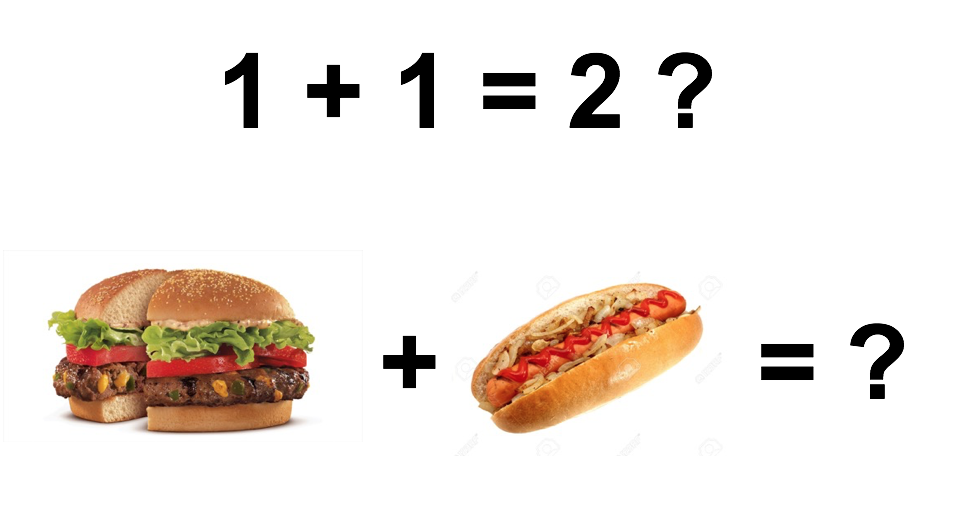
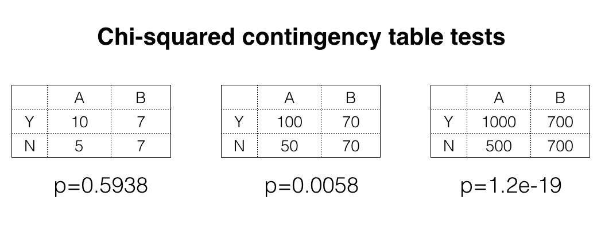
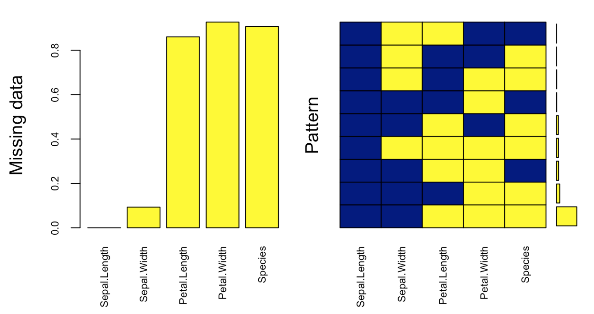
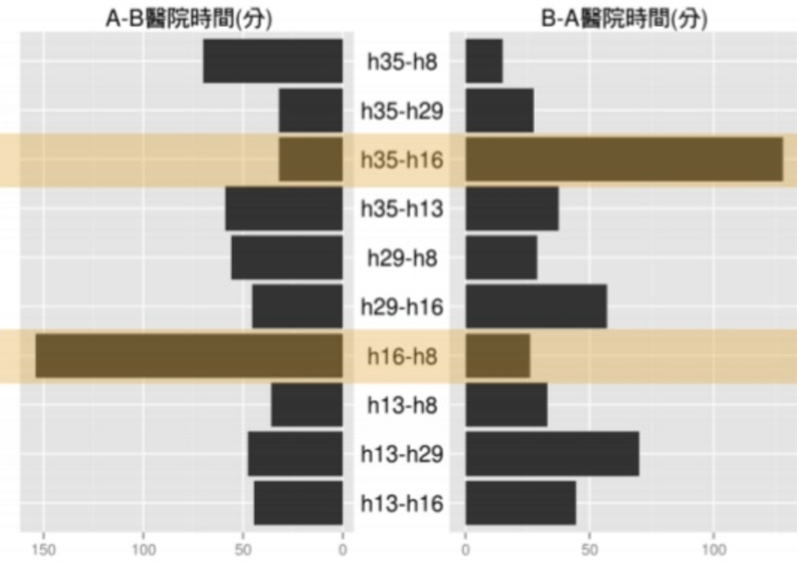
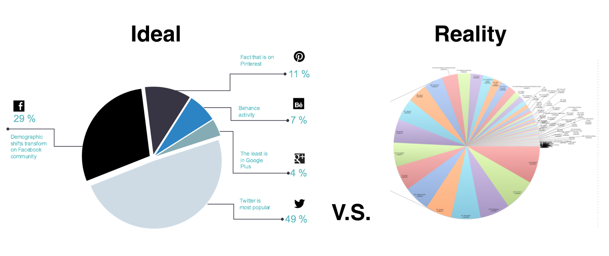
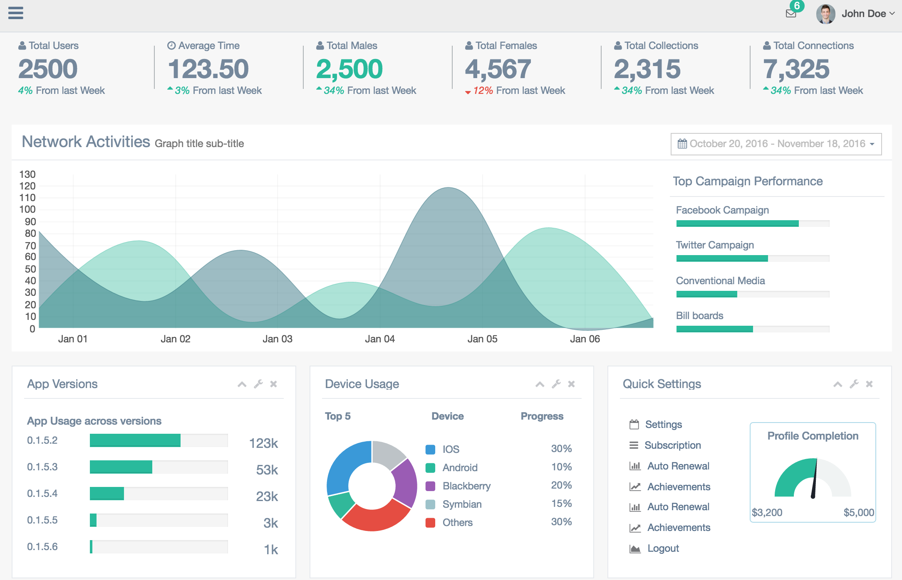
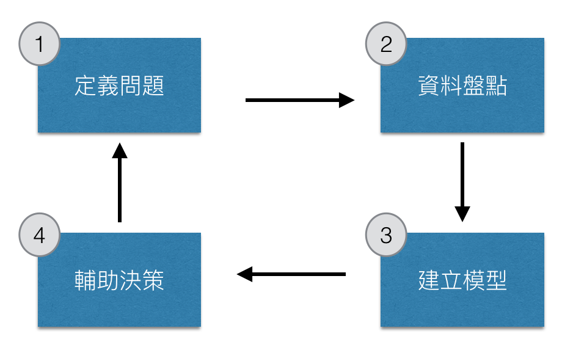

## About Me {.columns-2}
```{r setup, include=FALSE, cache=FALSE}
library(knitr)
library(magrittr)
library(xtable)
library(dplyr)
library(ggplot2)
opts_chunk$set(echo = FALSE, cache=TRUE, comment="", cache.path = ".cache-EDA/")
fig <- function(path, size = 100) {
  sprintf("</img>", 
          path, size, size)
}
fig2 <- function(path, size = 100) {
  sprintf("</img>", 
          path, size)
}
sys_name <- Sys.info()["sysname"] %>% tolower
sys_encode <- c("utf8", "utf8", "big5")[pmatch(sys_name, c("linux", "darwin", "windows"))]
sessionInfo() %>% capture.output %>% cat(file = "sessionInfo.log", sep = "\n")
```
### 謝宗震 博士 (Johnson Hsieh)
- R語言年資 10年
- 新竹清華統計 博士 (2009 - 2013)
- **DSP智庫驅動** 首席資料科學家 (dsp.im)
- 行政院青年諮詢委員會 委員
- 台北市公參會**開放資料組** 顧問
- D4SG資料英雄計畫主持人
- Taiwan R User group officer
- R package: `iNEXT`, `CARE1`, `JADE`, `SpadeR`, `iNextPD` ...

<br>
<p>
<br>

`r fig("johnson.jpg")`
<br>
<font size="2">
Johnson 致力於資料科學顧問服務，跨足零售、製造、新聞、電信、家防等領域，現職智庫驅動首席資料科學家，輔導政府機關、企業、非營利組織導入資料科學。
</font>


##

Hsieh, T. C., K. H. Ma, and Anne Chao. "`iNEXT`: an R package for rarefaction and extrapolation of species diversity (Hill numbers)." Methods in Ecology and Evolution (2016, cover artilce).

<center>
`r fig("inext_cover2.png",50)`
</center>
<font size="2">
This cover image shows a beautiful, brilliantly colored fairy pitta (Pitta nympha) perched on a bamboo branch. The migratory fairy pitta breeds in Northeast Asia (Japan, South Korea, east China and Taiwan) from late April to September and winters mainly in Borneo from October to March.
</font>


## {.vcentered .centered}

<p style="font-size: 180%">
這場演講將講述我們跟大型企業交手的經驗，</p>
<br>
<p style="font-size: 180%">
分享如何在地雷區完成任務的心得，
</p>
<br>
<p style="font-size: 180%">
特別適合想要**組隊接外包**數據專案的團隊，
</p>
<br>
<p style="font-size: 180%">
還有想啟動一個數據科學專案的**企業**。
</p>

## Agenda

<ul style="font-size: 140%">
<li>沒看到資料前，都是假的！</li>
<li>沒做 EDA 前，都是假的！</li>
<li>模型的準確度，都是假的！</li>
</ul>

# 沒看到資料前，都是假的！

## 資料的極限 - columns {.vcentered .centered}
</img>

> - 一個問題是否能透過資料解決和資料蒐集與記錄的方式有關。

## 資料的極限 - row {.vcentered .centered}
</img>

> - 樣本中的稀有事件或是未曾發生的事件難以配適模型。

## 資料的極限 - sample size {.vcentered .centered}
</img>

> - 統計顯著性會受到樣本數不足所影響。


## 資料的極限 - sample size
```{r echo=TRUE}
# R code here
x <- matrix(c(10, 5, 7, 7), ncol=2)
chisq.test(x)$p.value

y <- matrix(c(100, 50, 70, 70), ncol=2)
chisq.test(y)$p.value

z <- matrix(c(1000, 500, 700, 700), ncol=2)
chisq.test(z)$p.value
```
<center>
- 統計顯著性會受到樣本數不足所影響。
</center>

# 沒做 EDA 前，都是假的！

## 資料的品質 - missing value {.vcentered .centered}
</img>

> - 即使在資訊系統中事先規劃好欄位，還是有可能失敗。

## 資料的品質 - error log {.vcentered .centered}
```{r message=FALSE, warning=FALSE}
set.seed(123)
x <- seq(as.Date("2010/1/1"), as.Date("2015/1/1"), "days")
y <- arima.sim(list(order = c(1,1,0), ar = 0.7), n=length(x)-1)
y <- y + abs(min(y)) + 10
y[1000:1400] <- NA
dat <- data.frame(x, y)
ggplot(data=dat, aes(x=x,y=y)) +
  geom_point(size=0.5, col=adjustcolor(1,1)) +
  labs(x="Date", y="Value") +
  scale_x_date(date_breaks = "4 month") +
  geom_point(data=subset(dat, is.na(y)), 
             aes(x, y=0), col=2, size=0.5) +
  theme(axis.text.x = element_text(angle = 90, hjust = 1), 
        text=element_text(size=18))
```

> - 當感測器報錯時，不一定能夠用遺漏值插補來處理。


## 資料的品質 - illogic  {.vcentered .centered}
### A/B醫院相互轉診時間差異過大
</img>

> - 合乎資料系統邏輯，但是與真實經驗不合。

## 資料的品質 - unclear  {.vcentered .centered}
</img>

> - 預先規劃的BI介面，不一定能夠正式實行。

## 資料的品質 - summary
<ul style="font-size: 140%" class="build">
<li>剛拿到一批資料，**絕對不能**一頭栽進去做深入的分析，或是建立機器學習模型。</li>
<li>合格的數據科學家，要**先做探索性分析 (EDA)** 計算簡單統計量與視覺化觀察資料。</li>
<li>這些工具不只能描述資料的特性，更重要的是要檢驗資料的**乾淨度**與**正確性**。</li>
<li> 完成資料品質檢驗的具體方式就是完成一個**資料儀表板** (Dashboard)</li>
</ul>

## 資料的品質 - dashboard {.vcentered .centered}

</img>

- **資料儀表板** (dashboard) 是完成資料品質檢驗的具體成果。

## 建立**資料儀表板**的意義  {.vcentered .centered}
<br>
<p style="font-size: 140%">
確認資料已經可以**正確**的被取出並**視覺化**呈現，</p>
<br>
<p style="font-size: 140%">
讓組織中的不同團隊**共享資料**，提升全體素養，</p>
<br>
<p style="font-size: 140%">
減少資料科學團隊產生報表的需求，**減少內耗**，</p>
<br>
<p style="font-size: 140%">
建立起**信任感**，初步展現資料科學團隊的價值。</p>

# 模型的準確度，都是假的！

## 問對問題最困難 {.vcentered .centered}
### 數據科學專案流程
</img>

> - 完成**定義問題**跟**資料盤點**才能討論**建模**

## 真實問題 -> 科學模型 -> 實質成效
### 專案規劃上最難的是事先要對模型效力做評價
- 遇到資料極限、資料品質問題，神仙也難救
- 到底是關注**影響特徵**的解釋還是**成果預測**的準確？
    - regression model (linear, non-linear, interaction)
    - tree-baed model
- 模型評價還得銜接上實質影響力
    - 模型配適程度 $R^2$ 要多少才夠？準確率應該多高才對？
    - 模型建議200名潛在顧客，預計成效 xxx,xxx,xxx元

##
<center>
`r fig("namecard.png", 80)`
</center>